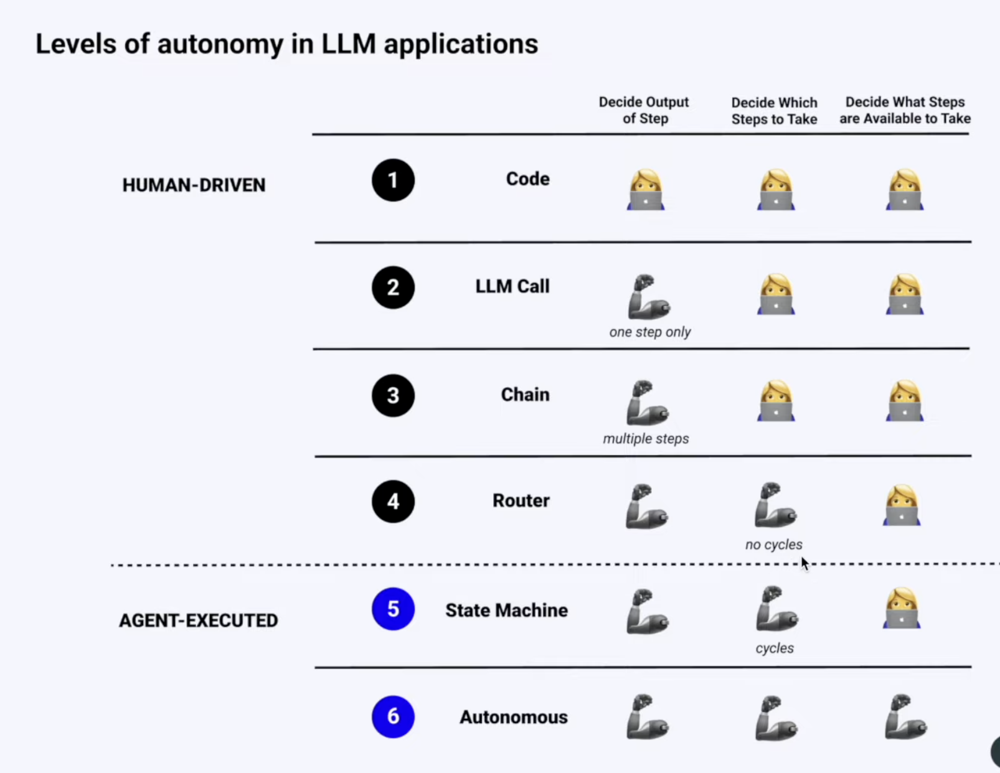
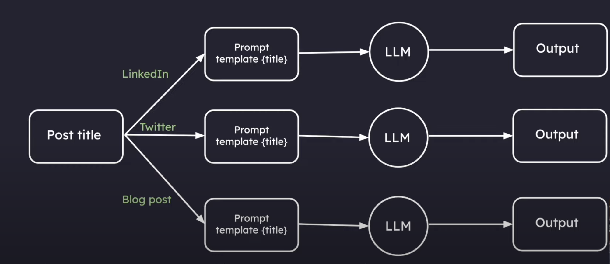
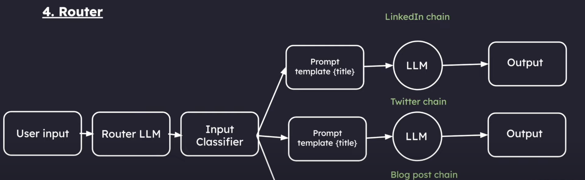
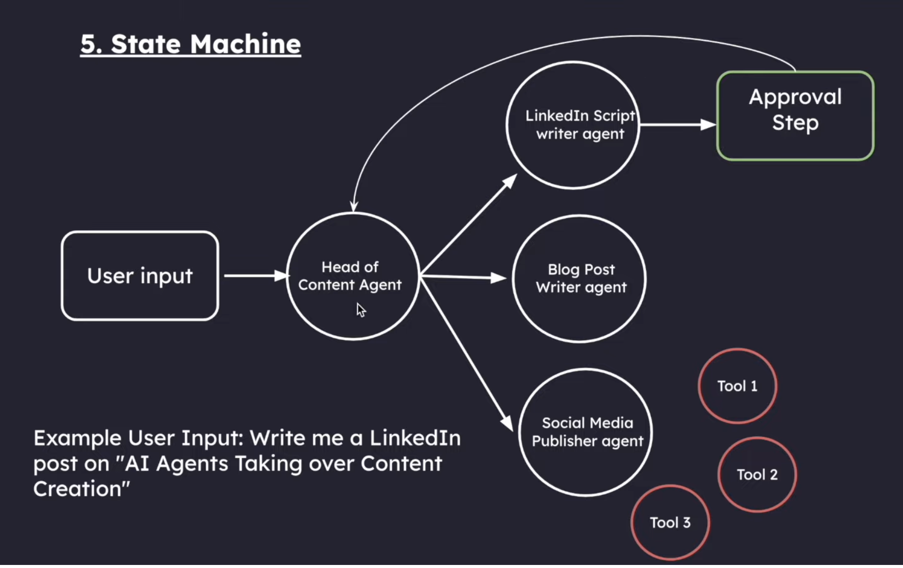

# Levels of Autonomy in LLM Applications

# Architecture

## 1. Code

Code has zero autonomy and is 100% deterministic.

We all know that everything is hard-coded, and it is not even really a cognitive architecture.

**Disadvantage:**

The problem? You'd need to write rules for every possible scenario - making it impossible to handle real-world complexity.

## 2. LLM call

A single LLM call means your app basically does one main thing - you give it an input, it processes it, and gives you back an output.

Think of chatbots that just take your message and respond, or apps that translate text.

This was a huge leap from hard-coded rules, even though it's still pretty simple and is only in the 2nd stage of autonomy.

**Disadvantage:**

Trying to get everything done in one shot often leads to confused or mixed responses - just like how a single person can't be an expert at everything.

## 3. Chains

Think of chains like having multiple specialists instead of one generalist. Instead of asking one AI to do everything, we break it down into steps where each AI is really good at one thing.

Imagine a customer service chatbot: The first AI reads your complaint and figures out exactly what product you're talking about.

The second AI finds the right solution from the company's help docs, and the third AI turns that solution into a friendly response.

Each step is simple, but together they create a much smarter system than a single LLM call could.

## 4. Router

Routers are like smart traffic cops for your AI. Instead of having a fixed path like in chains, the AI itself decides what steps to take next.

Imagine a personal assistant bot: when you ask it something, it first figures out if you need help with scheduling, research, or calculations, then routes your request to the right tool or chain for the job.

**Disadvantage:**

It cant remember previous Conversations or learn from its mistakes

Here is the text extracted from the image:

## 5. State Machine (Agent)

This is combining the previous level (router) but with loops.
Agent ~= control flow controlled by an LLM

This involves features like:
1. Ability to have human-in-loop, ask for approval before moving on
2. Multi-agent systems
3. Advanced memory management
4. Go back in history and explore better alternate paths

## Chain/Router vs Agent

A Chain or even a router is one directional. Hence, it is not an agent

Whereas in a state machine, we can go back in the chain, have cycles and the flow is controlled by the LLM, hence it is called an Agent

