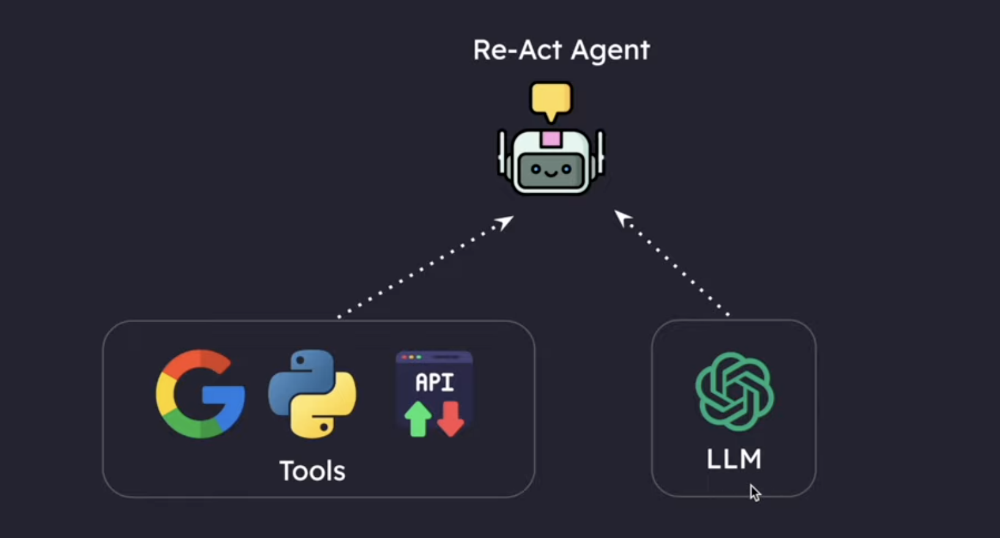
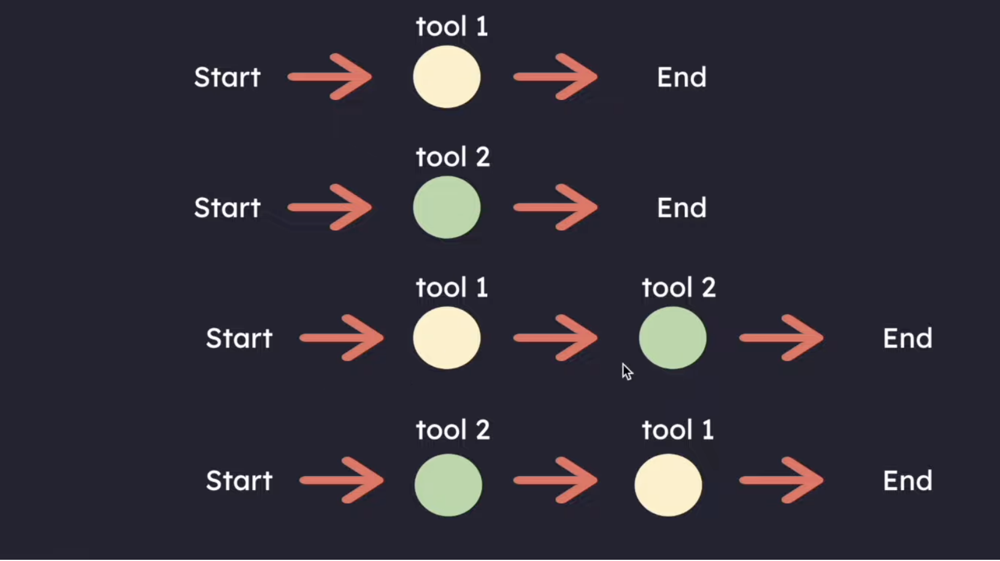

## React Pattern 

It stands for reasing + acting

**Think:** It first thinks

**Act:** The agent can act or perform the task using various tools available

**Observe:** Observe what happened

React Agents are flexible  and Any state is possible

**Disadvantages**

Infinite loops are problem with react agents

