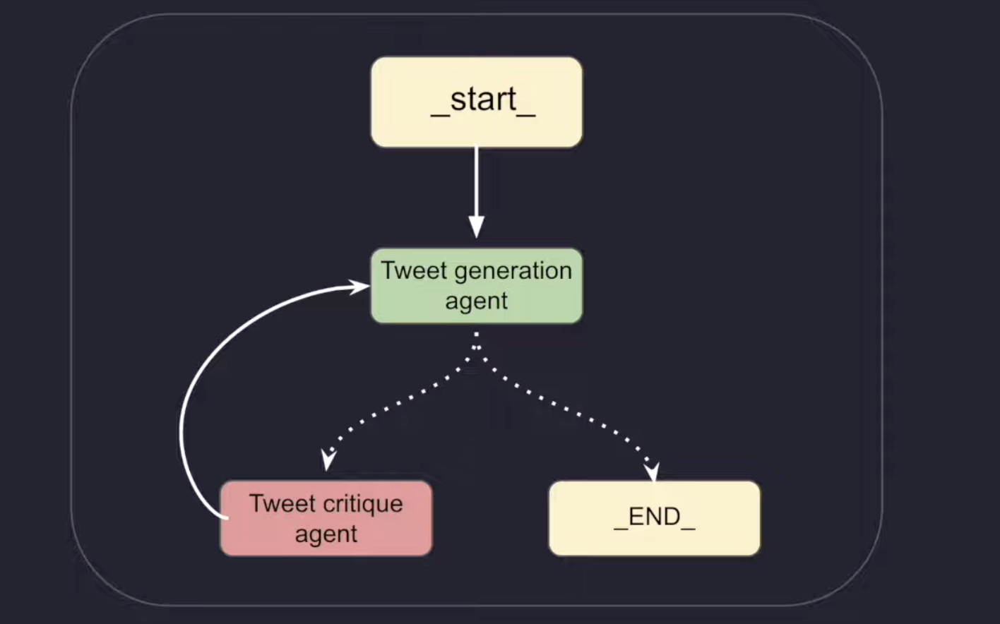

## Reflection Agent System

A refection agent pattern is an AI system 

**So what is a reflection-agent pattern?**

A reflection agent pattern is an AI system pattern that can look at its own outputs and think about them/make it better - just like how we look at ourselves in a mirror and self-reflect, make ourselves better.

A basic reflection agent system typically consists of:

1.  A generator agent
2.  A reflector agent

Types of refection Agent

1. Basic Reflection Agent
2. Reflexion Agent
3. Language Agent Tree Search

